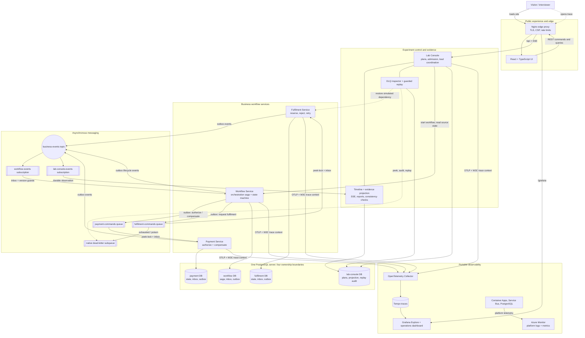
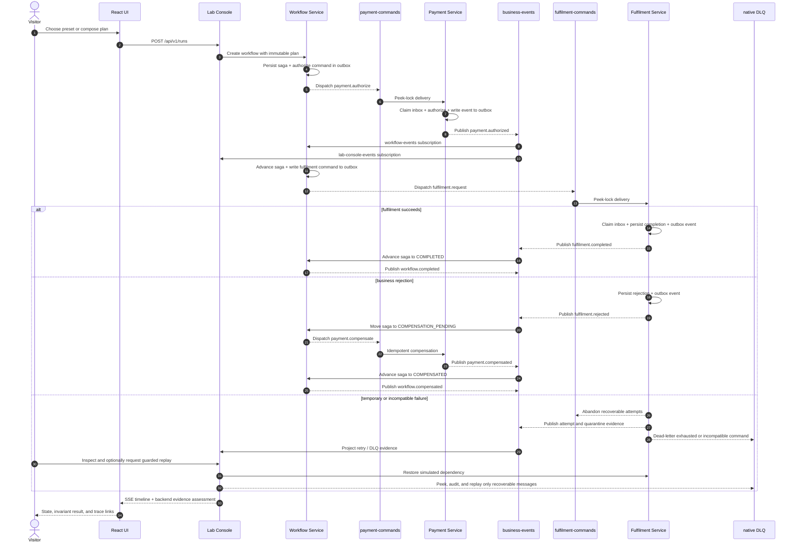
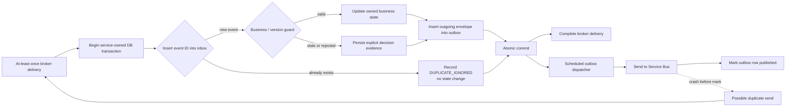

# EventLab architecture map

This document is the visual companion to the detailed [architecture](architecture.md) and
[decision records](decisions/README.md). It describes the implemented system rather than an
aspirational topology.

[Open the self-contained browser version](architecture-map.html).

## 1. Layered system map

The shared PostgreSQL and Service Bus infrastructure does **not** mean shared ownership.
Every service has its own database, credentials, inbox/outbox records, and transaction boundary.

## 2. Main workflow and compensation path

The Lab Console observes and explains the workflow; it does not mutate participant tables.
Its final claim is derived from persisted events and checked against Workflow's authoritative state.

## 3. Reliability boundary inside each state-changing consumer

This is intentionally **at-least-once**, not exactly-once delivery. A crash after the broker accepts
an outbox message but before the row is marked can resend it; the receiving inbox makes that safe and
visible.

## 4. Runtime mapping

| Architectural role | Local development | Disposable Azure environment |
| --- | --- | --- |
| Public edge and UI | Vite dev server | Nginx frontend Container App with rate limiting |
| Java services | Four Spring Boot processes | Four Azure Container Apps |
| Broker | Official Azure Service Bus emulator | Azure Service Bus Standard with managed identity |
| Persistence | One PostgreSQL container, separate databases | PostgreSQL Flexible Server, separate databases and logins |
| Trace pipeline | OpenTelemetry Collector → Tempo → Grafana | OpenTelemetry → internal Tempo/Grafana; Azure Monitor for platform telemetry |
| Provisioning | Docker Compose | Terraform through protected GitHub Actions and Azure OIDC |
| Lifecycle | Developer-controlled | Time-limited 2, 8, or 24-hour environment with automated destruction |

## 5. Architectural invariants

- The browser reaches business execution only through the Lab Console control plane.
- Workflow owns orchestration; Payment and Fulfilment own their participant state.
- Services never read or write another service's database.
- Commands use dedicated queues; lifecycle events fan out through topic subscriptions.
- Inbox, outbox, optimistic locking, and aggregate-version guards make redelivery and reordering safe.
- The evidence projection explains execution, while Workflow remains the authoritative business state.
- Traces explain which code path ran; persisted state and evidence checks prove the durable outcome.
- Load experiments use the same APIs, broker, consumers, databases, and evidence path as single runs.
