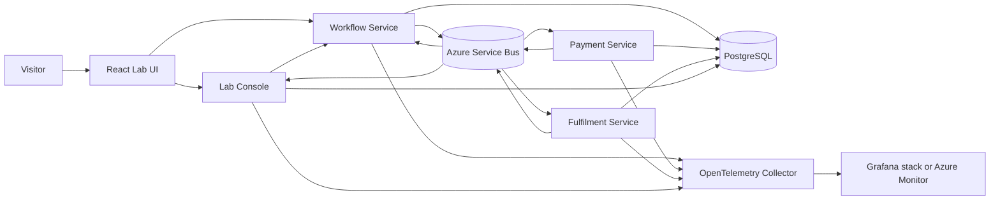

# EventLab proposed architecture

## 1. Purpose

EventLab is an interactive failure simulator for distributed workflows. A visitor starts a small order-fulfilment workflow, injects a deterministic failure, observes its effects, and performs recovery actions when appropriate.

The educational subject is the distributed execution, not the order domain. The interface must explain:

- current workflow state;
- messages exchanged between services;
- delivery attempts and exponential backoff;
- duplicate and stale deliveries;
- dead-lettered messages;
- saga decisions and compensation;
- trace and span relationships;
- manual replay and eventual recovery;
- expected and actual invariants.

## 2. Architectural principles

1. Keep the business domain intentionally small.
2. Use the minimum number of deployables that makes a saga credible.
3. Make experiments deterministic, isolated by workflow run, and repeatable.
4. Preserve service data ownership even when infrastructure is shared.
5. Use Azure-native managed services at deployment boundaries while keeping business logic and telemetry standards portable.
6. Do not pretend different brokers or in-process events have identical semantics.
7. Prefer a real distributed demo plus a permanent static portfolio page over a second consolidated runtime.
8. Do not add Kubernetes, a service mesh, or another platform solely to increase the technology count.

## 3. System context



## 4. Deployable components

### 4.1 Lab UI

A React, TypeScript, and Vite application providing:

- a curated scenario picker;
- start, reset, and recovery controls;
- a workflow state diagram;
- an ordered event and delivery-attempt timeline;
- retry/backoff and DLQ panels;
- expected-versus-actual invariants;
- links to the relevant trace or spans.

The UI is an experiment console, not an administration or CRUD interface.

### 4.2 Lab Console

The Lab Console owns experiment presentation and control-plane concerns:

- scenario definitions and deterministic seeds;
- scoped fault configuration for a workflow run;
- a read model built from observed lifecycle events;
- live UI updates through Server-Sent Events initially;
- DLQ inspection and guarded replay requests;
- trace identifiers and explanatory metadata.

It must not change business state by editing another service's database. Recovery occurs through explicit messages or service APIs. Fault-control interfaces must be separated from ordinary business interfaces.

### 4.3 Workflow Service

The Workflow Service owns:

- order/workflow creation;
- the persisted orchestration saga;
- the workflow state machine and version;
- participant commands;
- timeouts and compensation decisions;
- workflow invariants;
- optimistic concurrency handling.

It coordinates the workflow but does not own payment or fulfilment state.

### 4.4 Payment Service

The Payment Service models only behavior necessary for the experiments:

- authorize payment;
- reject authorization;
- void or refund as compensation;
- process commands idempotently;
- publish resulting events through an outbox.

There is no external payment provider in the MVP.

### 4.5 Fulfilment Service

The Fulfilment Service combines stock reservation and shipment scheduling for the MVP. It can:

- accept or reject fulfilment;
- simulate slow or unavailable processing;
- release a reservation during compensation;
- process commands idempotently;
- publish resulting events through an outbox.

Inventory and Shipment will be split only if a later scenario benefits materially from separate ownership or failure modes.

## 5. Workflow

The happy path is deliberately short:

```text
Order accepted
  -> payment authorized
  -> fulfilment reserved and scheduled
  -> workflow completed
```

If fulfilment fails after payment authorization, the Workflow Service issues a payment-compensation command. The final workflow state records whether compensation succeeded or requires intervention.

The saga is orchestration-based because the coordinator's decisions, timeouts, and compensations need to be visible and explainable. Saga state is persisted; it is not reconstructed solely from UI events or traces.

## 6. Messaging

### 6.1 Broker

Azure uses Azure Service Bus Standard. Local development and automated tests use the official containerized Service Bus emulator wherever its supported behavior is sufficient.

The initial topology contains:

- service-specific command queues;
- a business-events topic;
- filtered service and Lab Console subscriptions;
- native dead-letter subqueues.

Exact entity names will be fixed during the walking-skeleton milestone and provisioned through configuration/Terraform rather than created dynamically by application code.

### 6.2 Delivery semantics

Consumers use peek-lock processing and explicitly complete, abandon, defer, or dead-letter messages. At-least-once delivery is assumed.

Every state-changing consumer must be idempotent. Broker duplicate detection, when a scenario enables it, is an additional send-side mitigation and not a replacement for consumer idempotency.

Outbox and inbox patterns provide:

- atomic business-state and outgoing-event persistence;
- stable event identifiers;
- safe redelivery handling;
- an audit trail for explaining delivery behavior.

### 6.3 Event envelope

Application code uses an EventLab envelope rather than Azure SDK types:

```text
eventId
eventType
schemaVersion
workflowId
causationId
correlationId
occurredAt
payload
```

Delivery attempts are transport observations and are not trusted as immutable business-event data. The Service Bus adapter maps envelope metadata to broker fields such as message and correlation identifiers.

### 6.4 Ordering and concurrency

Workflow messages carry an aggregate/workflow version. Consumers reject or safely ignore stale transitions using persisted version and idempotency information.

Service Bus sessions are introduced in a comparison scenario rather than enabled globally. This lets the project demonstrate both unordered concurrent handling and per-workflow ordered processing.

### 6.5 Replay

Replay is a controlled operation, not an unrestricted resend button. A replay records:

- the original message identifier;
- a new delivery/replay identifier where required;
- who or what initiated the replay;
- timestamp and reason;
- schema compatibility result;
- the target queue or topic;
- the resulting outcome.

Version checks and idempotency remain active during replay.

## 7. Deterministic failure injection

The MVP provides curated scenarios rather than a general chaos scripting language. A scenario definition identifies:

- the target handler or transition;
- the failure type;
- the occurrence or attempts on which it applies;
- delay and retry parameters;
- whether the fault occurs before or after persistence;
- a deterministic seed;
- the expected invariant and recovery path.

Faults are scoped to a workflow run so concurrent visitors do not affect each other. Application-level injection is the primary MVP mechanism because it is repeatable and explainable. Container termination and network faults are later experiments.

## 8. Initial scenarios

### Duplicate payment result

Deliver the same logical result more than once. The timeline shows multiple deliveries but only one valid state transition, supported by the consumer inbox record.

### Fulfilment unavailable

Fulfilment fails for configured attempts. The UI shows retry delay, delivery count, exhaustion, DLQ placement, operator replay, and recovery.

### Fulfilment rejection and compensation

Payment succeeds and fulfilment rejects the order. The saga commands payment compensation and displays the forward and compensating paths.

### Stale or out-of-order update

Planned immediately after the MVP: a delayed older update arrives after a newer version and is rejected without corrupting workflow state.

## 9. Persistence and data ownership

Azure initially uses one small PostgreSQL Flexible Server without high availability. Local development uses one PostgreSQL container.

Each backend component owns a separate database or schema and credentials:

- Workflow: workflow, saga, timeout, outbox, and inbox data;
- Payment: payment, compensation, outbox, and inbox data;
- Fulfilment: fulfilment, compensation, outbox, and inbox data;
- Lab Console: scenario-run projection, delivery observations, and replay audit.

Services never read or write another service's tables. Sharing one PostgreSQL server is an infrastructure cost decision, not shared data ownership. Flyway owns schema evolution.

## 10. Observability

### 10.1 Portable instrumentation

All services use OpenTelemetry and W3C trace context. Context is propagated through HTTP and Service Bus application properties. Telemetry includes:

- traces for HTTP, publish, receive, handler, database, retry, and compensation operations;
- metrics for workflow outcomes, processing duration, retries, duplicates, stale messages, DLQ depth, and replay;
- structured logs containing workflow, event, correlation, trace, and span identifiers.

Application code should avoid direct dependence on a specific telemetry backend.

### 10.2 Local backend

The local Compose environment uses:

- OpenTelemetry Collector;
- Tempo for traces;
- Prometheus for metrics;
- Grafana for dashboards;
- structured container logs initially, with Loki added after tracing is working.

### 10.3 Azure backend

Azure uses Azure Monitor/Application Insights for application telemetry and Azure platform metrics for Container Apps, Service Bus, and PostgreSQL. Sampling, short retention, controlled log levels, and ingestion caps protect the student credit.

A complete Grafana/Tempo/Loki deployment will not run permanently in Azure. Local observability demonstrates the portable stack; Azure demonstrates native operational tooling.

## 11. Local deployment

Docker Compose will eventually start:

- the four Spring Boot applications;
- the React UI;
- PostgreSQL;
- the Service Bus emulator and its required dependencies;
- OpenTelemetry Collector, Tempo, Prometheus, and Grafana;
- Loki only after the tracing milestone.

The emulator is for development and tests, not a production substitute. Azure smoke tests must cover cloud-only behavior such as managed identity, RBAC, platform monitoring, and any relevant emulator differences.

## 12. Azure deployment

Backend applications run on Azure Container Apps Consumption. Scale-to-zero is used where practical. Java cold-start behavior is measured rather than hidden; demonstration environments may temporarily use minimum replicas when responsiveness is important.

Application images are built once in GitHub Actions, tagged with the immutable Git commit SHA, stored in GitHub Container Registry, and referenced by digest or immutable tag during deployment.

### 12.1 Persistent bootstrap infrastructure

Managed by a separate Terraform root/state:

- a small Azure Storage account and container for remote Terraform state;
- GitHub Actions federated identity in Microsoft Entra ID;
- narrowly scoped deployment role assignments;
- any essential state-locking/bootstrap resources;
- optionally, permanent static portfolio hosting.

Bootstrap infrastructure contains no application runtime resources.

### 12.2 Disposable application infrastructure

One resource group per environment, managed by its own remote state key:

- Container Apps environment, services, UI, and jobs;
- Service Bus Standard namespace, queues, topics, and subscriptions; Service Bus supplies the associated dead-letter subqueues;
- one small PostgreSQL Flexible Server;
- managed identities and role assignments;
- Azure Monitor/Application Insights resources;
- only the networking and supporting resources that are demonstrably required.

Resources receive ownership, environment, commit, creation, and `destroy_after` tags.

### 12.3 CI/CD operations

`plan` validates the requested lifetime, calculates a UTC `destroy_after`, selects a deterministic environment/state key, and produces a reviewable Terraform plan.

`deploy` runs verification, builds and pushes immutable images, applies Terraform, runs Flyway, performs deterministic idempotent seeding, executes smoke tests, and publishes the URL and expiry.

`destroy` selects the exact state key, runs Terraform destroy, and verifies removal of the application resource group.

A scheduled cleanup workflow finds expired EventLab environments and invokes the same destroy path. It reports failures and separately detects project resources missing expiry metadata. The supported initial lifetimes are 2, 8, and 24 hours.

GitHub Actions authenticates to Azure using OIDC federation with Entra ID; long-lived Azure client secrets are prohibited.

## 13. Cost posture

The student credit is protected primarily by destruction, not by stopping resources indefinitely.

Main cost drivers are:

- PostgreSQL compute, provisioned storage, and backup storage;
- the continuous Service Bus Standard base charge;
- Container Apps replicas that cannot scale to zero;
- Azure Monitor log/trace ingestion and retention;
- optional networking resources such as private endpoints or NAT;
- network egress.

Initial Azure choices are one burstable PostgreSQL server, no database HA, Service Bus Standard rather than Premium, Container Apps Consumption, telemetry sampling and short retention, and no unnecessary private networking. Current regional prices must be checked in the Azure calculator before deployment.

## 14. Testing strategy

- Unit tests for state machines, handlers, compensation, failure plans, and invariants.
- Architecture tests after module boundaries stabilize.
- PostgreSQL Testcontainers tests for Flyway, inbox/outbox, locking, and repositories.
- Service Bus emulator integration tests for supported messaging behavior.
- Multi-service workflow tests for happy path, duplicate delivery, retry/DLQ, compensation, and stale updates.
- Azure smoke tests for deployment, identity/RBAC, messaging, database migration, seeding, telemetry, and teardown readiness.
- Selected k6 resilience/performance tests only after functional recovery scenarios are stable.

## 15. Explicit non-goals for the MVP

- Customer accounts or a rich product catalogue.
- Addresses, shipping rates, or parcel CRUD.
- A general-purpose workflow engine.
- A user-programmable chaos DSL.
- Event sourcing as the system of record.
- A consolidated Spring Modulith runtime.
- Kafka/Redpanda or multiple production messaging adapters.
- Kubernetes, service mesh, or API Management.
- Multi-region or production-grade high availability.
- Permanently running billable Azure application infrastructure.

## 16. Evolution criteria

New infrastructure or service boundaries require a named experiment or learning outcome. Inventory and Shipment may be split, Kafka may be added as a comparative adapter, or local Kubernetes may be introduced only when the existing architecture cannot demonstrate the intended behavior clearly.
